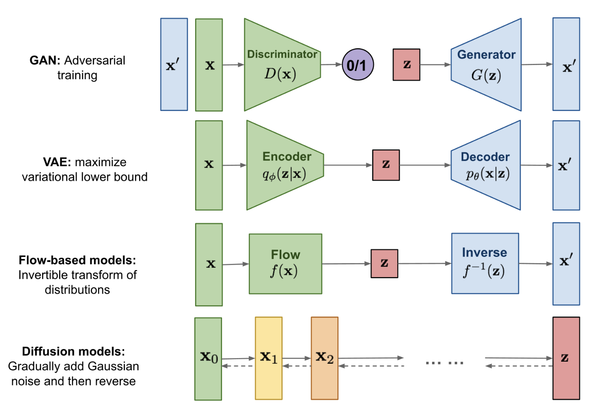

<!-- title page -->
## A survey on deep learning image classification technics based on PyTorch and PyTorch lightning

Zhang Yuxuan, Jiang Wenxin, Fan Yifei, Zhang Juntao <small>(In order of speakers)</small>

--------------------
## Contents
1. [Image Generation](https://lucajiang.github.io/PyTorch_ImageClassifiction_Techniques/slideshow/#/2)
2. [Training and Tuning with Tricks](https://lucajiang.github.io/PyTorch_ImageClassifiction_Techniques/slideshow/#/6)
3. [Graph Attention ViT](https://lucajiang.github.io/PyTorch_ImageClassifiction_Techniques/slideshow/#/20)
4. [Interpretion](https://lucajiang.github.io/PyTorch_ImageClassifiction_Techniques/slideshow/#/27)

--------------------
## Data Augmentation: Image Generation

* Increasing model's ability to generalize to new and unseen data.
* Help the model learn more robust and invariant features.

<center></center>

--------------------
### ACGAN

<center></center>

--------------------
### Diffusion Model

* Foward process 

$$
q\left(x_t \mid x_{t-1}\right)=\mathcal{N}\left(x_t ; \sqrt{1-\beta_t} x_{t-1}, \beta_t \mathbf{I}\right)
$$

$$
q\left(x_{1: T} \mid 
x_0\right)=\prod_{t=1}^T q\left(x_t \mid x_{t-1}\right)
$$

* Reverse process 

$$
p_\theta\left(x_{0: T}\right)=p\left(x_T\right) \prod_{t=1}^T p_\theta\left(x_{t-1} \mid x_t\right)
$$

$$
p_\theta\left(x_{t-1} \mid 
x_t\right)=\mathcal{N}\left(x_{t-1} ; \mu_\theta\left(x_t, t\right), \Sigma_\theta\left(x_t, t\right)\right)
$$

* loss

$$
L_t^{\text {simple }} = \mathbb{E}_ {t \sim [1,T] , \mathbf{x}_ {0}, \boldsymbol{\epsilon}_ {t}} \left[||\boldsymbol{\epsilon}_ t-\boldsymbol{\epsilon}_ \theta\left(\sqrt{\bar{\alpha}_ t} \mathbf{x}_ 0+\sqrt{1-\bar{\alpha}_ t} \boldsymbol{\epsilon}_ t, t\right)||^2 \right]
$$


--------------------
### Generated Dataset

<center></center>


--------------------
<!-- Jiang Wenxin begin -->
## Training and Tuning with Tricks for CIFAR-10 dataset in PyTorch and PyTorch Lightning

Jiang Wenxin

--------------------
- Easy convert


--------------------
- Less code, more efficient.
```python
callbacks = [
    ModelCheckpoint(monitor="val_acc", mode="max"),
    LearningRateMonitor(logging_interval="step"),
    StochasticWeightAveraging(swa_lrs=1e-2),
    early_stopping,
]
trainer = Trainer(
    max_epochs=50,
    devices='auto', # auto choose GPU or CPU
    logger=wandb_logger,
    callbacks=callbacks, # defined above
)
```
--------------------
##  Datasets and models

* Dataset: [CIFAR-10](https://www.cs.toronto.edu/~kriz/cifar.html)
* Model: ResNet18 or ResNet34 from [TorchVision.Models](https://pytorch.org/vision/0.8/models.html)
* Loss Function: NLL(Negative Log-Likelihood)
* Optimizer: SGD(Stochastic Gradient Descent) or Adam(Adaptive Moment Estimation)
* Hyperparameters: Learning Rate, Batch Size, Schedule, etc.

--------------------
### Transforms: Data Augmentation
Tools: random crop, random flip, random rotation, etc.
Benefits of data augmentation:
* Increase the size of the dataset -> Reduce **overfitting**
* Improve **generalization** -> Improve the performance of the model
* Increase at least **3%** accuracy in CIFA-10$^1$


--------------------
### Transforms: Data Normalization and Resizing
Tools: Normalize, Resize, etc.
Why data normalization?
* Easier to converge
* Prevent gradient explosion / vanish
* Make features have the same scale
  
Why data resizing?
* Reduce the size of the img -> Save time
* Fit the size of input layer
--------------------
### Transfer Learning
* Use the pretrained model to initialize the weights of the model
```python
model = torchvision.models.resnet18(pretrained=True)
```
Useful when dataset is small.

### Replicability and Determinism
```python
# for hardware
torch.backends.cudnn.deterministic = True
torch.backends.cudnn.benchmark = False
# for numpy/pytorch package
seed_everything(42)
```
--------------------
### Tricks: Learning Rate Finder
<small>(But it sometimes doesn't work well.)</small>
Not to pick the lowest loss, but in the middle of the sharpest downward slope (red point).

<!-- It determines a range of learning rates by gradually increasing the learning rate during training and observing the change in the loss function, thus helping us to better select the learning rate to improve the training effect and convergence speed of the model. -->


--------------------
## [Effective Training Techniques](https://lightning.ai/docs/pytorch/stable/advanced/training_tricks.html)
```python
callbacks = [
    LearningRateMonitor(logging_interval="step"),
    StochasticWeightAveraging(swa_lrs=1e-2),
    GradientAccumulationScheduler(scheduling={...}),
    early_stopping
]

trainer = Trainer(
    gradient_clip_val=0.5,
    devices='auto',  # default
    logger=wandb_logger,...
)
```
--------------------
- **Accumulate Gradients:**
Accumulated gradients run K small batches of size N before doing a backward pass, resulting a KxN effective batch size.

Control batch size, improve the stability and generalisation of the model
<!-- Increasing the batch size without increasing the memory overhead. Also, the gradient accumulation technique can help us reduce the variance of gradient descent and improve the stability and generalisation of the model. -->

--------------------
- **Early Stopping:**
Stop at the best epoch, not the last epoch.
Avoid over-fitting.

- **Gradient Clipping:** 
Gradient clipping can be enabled to **avoid exploding gradients**. 

- **Stochastic Weight Averaging:** 
Smooths the loss landscape thus making it harder to end up in a local minimum during optimization. Improves generalization.

- **Learning Rate Scheduler:**
Control learning rate. Make the model converge faster.

--------------------
- **Manage Experiment:** Weights and Biases: [WandB](https://wandb.ai/site)

Before training:

After training:


--------------------
- **Manage Experiment:** Weights and Biases: [WandB](https://wandb.ai/site)
Dashboard:

Or more commonly used: TensorBoard

--------------------
## Results

<!-- <center class="half">
    
</center> -->

<!-- 

 -->
<!-- jiangwx end -->

--------------------

## Graph Attention ViT

In pratice, since the transformer becomes more and more popular, many companies and researchers want to add **attention** block to their existed model in order to improve the performance. However, training an attention related model is computation consuming and not easy.

In this project, we add the attention block to the resnet18 model. And we follow the ViT structure to utilize the attention block.

<center></center>

-----------------

## The basis of attention

- The general form for the self-attention

    $$
    A_{ij}=f(h_i,h_j)
    $$

    where $h_i$ and $h_j$ are the features for node $i$ and $j$, and $f$ is an arbitrary function that computes the attention score between two nodes.

- The classical self-attention

    $$
    A=softmax\left(\frac{H^{\top}(Q^{\top}K)H}{\sqrt{d_k}}\right)
    $$

    where $H\in\mathbb{R}^{f\times n}$ is the feature matrix for each embedding, $Q,K\in\mathbb{R}^{f^{'}\times f}$ are the query and key matrix for self-attention, and $d_k$ is the dimension of the key vector. Actually, it's just a bilinear function. 

-----------------

## Graph Attention Block

The graph attention block is shown in the following figure,

<center></center>

- The formula for graph attention

    $$
    A_{ij}=softmax(\sigma(W^{\top}[h_i||h_j]))
    $$

    where $W\in\mathbb{R}^{f\times 1}$ is the weight, $h_i\in \mathbb{R}^{f}$ is the feature of the $i^{th}$ node  and $\sigma$ represents for activation function.

-----------------

## Graph Attention Block

Convert in this form, the attention matrix $A$ can be computed as follows:

$$
A=softmax(\sigma(W_K^{\top}H+H^{\top}W_Q))
$$

where $H\in\mathbb{R}^{f\times n}$ is the feature matrix of all nodes.

Then we can implement the graph attention block in pytorch like this:

```python
Q = H @ W_Q
# Q : (batch, nodes, 1)
K = H @ W_K
# K : (batch, nodes, 1)
A = torch.softmax(self.activation(Q.transpose(-1,-2)+K),dim=-1)
# A : (batch, nodes, nodes)
```

<!-- Comparing to the traditional attention block, the graph attention block use addition between Q and K instead of matrix multiplication, which reduce computation -->

-----------------

## Conv2d Embedding

In order to use the graph attention block, we should convert patches into feature vectors of nodes in the graph.
In this project, we use the `Conv2d` layer to convert instead of the `Flatten` layer. 

```python
nn.Conv2d(chans,feats,kernel_size=patch_size,stride=patch_size)
```

Set the `kernel_size` and `stride_size` equal to `patch_size`.

-----------------

## Experiment


|           Model           | Pretrained | Attention | Epoch Consuming | Test Accuracy |
| :-----------------------: | :--------: | :-------: | :-------------: | :-----------: |
|         Resnet18          |            |           |       50        |     0.926     |
|   Resnet18 + GraphAtten   |            |     ✔️     |       50        |     0.918     |
|  Resnet18 \|> GraphAtten  |     ✔️      |     ✔️     |        5        |   **0.935**   |
| Resnet18 \|> ClassicAtten |     ✔️      |     ✔️     |        5        |     0.931     |

The test accuracy even decreases when we add the attention block to the resnet18 model and train whole model from the begining. However, when we use the pretrained model, the metric increases.

-----------------

## Conclusion

In conclusion, using the pretrained model to boost the performance of new added attention block is a good choice.

Here are the advantages of this method:

1. Don't need to train the whole model from the beginning. It's easy to just train a new added block.
2. Improve the performance of the existed model just in a few epochs, saving time and money.

--------------------
<!-- zjt -->
--------------------
# Reference
1. Shorten C, Khoshgoftaar T M. A survey on image data augmentation for deep learning[J]. Journal of big data, 2019, 6(1): 1-48.
1. PyTorch Lightning: https://lightning.ai/docs/pytorch/stable/
2. PyTorch Lightning CIFAR-10: https://lightning.ai/docs/pytorch/stable/notebooks/lightning_examples/cifar10-baseline.html
3. Training tricks: https://lightning.ai/docs/pytorch/stable/advanced/training_tricks.html
--------------------
# Reference
5. Graph Attention: https://www.baeldung.com/cs/graph-attention-networks
6. Diffusion Model:https://lilianweng.github.io/posts/2021-07-11-diffusion-models/#:~:text=Diffusion%20models%20are%20inspired%20by,data%20samples%20from%20the%20noise
7. Cifar-10 Generation with Diffusion Model:https://github.com/zoubohao/DenoisingDiffusionProbabilityModel-ddpm-
8. Axiomatic Attribution for Deep Networks:https://arxiv.org/pdf/1703.01365.pdf
--------------------

# Thanks for your listening!
