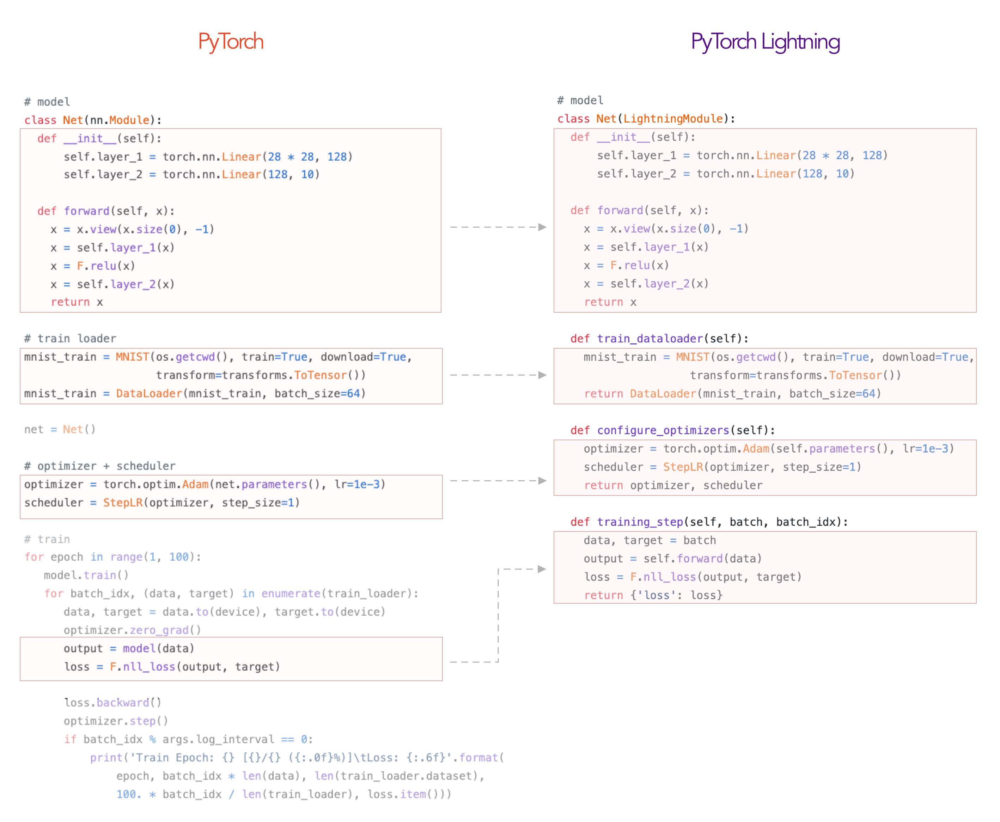

# Training and Tuning with Tricks for CIFAR-10 dataset in PyTorch and PyTorch Lightning

Jiang Wenxin

--------------------
<!-- ## PyTorch to PyTorch Lightning -->


--------------------
```python
callbacks = [
    ModelCheckpoint(monitor="val_acc", mode="max"),
    LearningRateMonitor(logging_interval="step"),
    StochasticWeightAveraging(swa_lrs=1e-2),
    early_stopping,
]
trainer = Trainer(
    max_epochs=50,
    devices='auto',  
    logger=wandb_logger,
    callbacks=callbacks,
)
```
--------------------
##  Overview and Basics
What we need know about training a model:
* Dataset: [CIFAR-10](https://www.cs.toronto.edu/~kriz/cifar.html)
* Model: ResNet18 or ResNet34 [TorchVision.Models](https://pytorch.org/vision/0.8/models.html)
* Loss Function: NLL(Negative Log-Likelihood)[^1]
* Optimizer: SGD(Stochastic Gradient Descent) or Adam(Adaptive Moment Estimation)[^2]
* Hyperparameters: Learning Rate, Batch Size, Schedule, etc.
[^1]: The same with CrossEntropyLoss in one-hot encoding.
[^2]: Adam is one of the most popular optimizers in deep learning.

--------------------
## Transforms: Data Augmentation
Tools: random crop, random flip, random rotation, etc.
Benefits of data augmentation:
* Increase the size of the dataset -> Reduce <mark>overfitting</mark>
* Improve generalization -> Improve the performance of the model


--------------------
## Transforms: Data Normalization and Resizing
Tools: Normalize, Resize, etc.
Why data normalization?
* Easier to converge
* Prevent gradient explosion / vanish
* Make features have the same scale
  
Why data resizing?
* Reduce the size of the img -> Save time
* Fit the input size of your model[^3]
[^3]: But we choose to change the input size of our model.

--------------------
## Before Training:
### Tricks: Learning Rate Finder
Not to pick the lowest loss, but in the middle of the sharpest downward slope (red point).

<!-- It determines a range of learning rates by gradually increasing the learning rate during training and observing the change in the loss function, thus helping us to better select the learning rate to improve the training effect and convergence speed of the model. -->

--------------------
## [Effective Training Techniques](https://lightning.ai/docs/pytorch/stable/advanced/training_tricks.html)
```python
callbacks = [
    LearningRateMonitor(logging_interval="step"),
    StochasticWeightAveraging(swa_lrs=1e-2),
    GradientAccumulationScheduler(scheduling={...}),
    early_stopping
]

trainer = Trainer(
    gradient_clip_val=0.5,
    devices='auto',  # default
    logger=wandb_logger,...
)
```
--------------------
- Manage Experiment: [WandB](https://wandb.ai/site)
Weights and Biases
<!-- todo add img -->

--------------------
- Accumulate Gradients: 
Accumulated gradients run K small batches of size N before doing a backward pass, resulting a KxN effective batch size.

Control batch size, improve the stability and generalisation of the model
<!-- Increasing the batch size without increasing the memory overhead. Also, the gradient accumulation technique can help us reduce the variance of gradient descent and improve the stability and generalisation of the model. -->

--------------------
- Gradient Clipping: 
Gradient clipping can be enabled to avoid exploding gradients. 

--------------------
- Stochastic Weight Averaging: 
Stochastic Weight Averaging (SWA) can make your models generalize better at virtually no additional cost. This can be used with both non-trained and trained models. The SWA procedure smooths the loss landscape thus making it harder to end up in a local minimum during optimization.
<!-- 它可以帮助模型更好地泛化，同时不需要额外的训练成本。SWA 适用于非常大的模型和数据集，可以有效的避免模型陷入局部最小值，提高模型的泛化能力。

具体来说，SWA 技术通过计算多个不同时间点的模型权重的平均值，来获得一个平均权重，从而获得一个更加平滑的损失函数，并提高模型的泛化能力。在训练过程中，SWA 技术会周期性地计算模型权重的平均值，并将这个平均权重用于后续的预测。

SWA 技术的优点在于，它不需要增加额外的训练成本，因为权重平均可以在训练结束后进行计算，而不需要对模型进行重新训练。此外，SWA 技术可以有效地平滑损失函数，从而减少模型陷入局部最小值的风险，提高模型的泛化能力。 -->

<!-- 需要注意的是，SWA 技术需要在训练结束后进行计算，因此可能需要一定的额外计算时间。同时，SWA 技术对于一些特定的模型和数据集可能效果并不明显。因此，在使用 SWA 技术时，需要根据具体的情况进行调整和优化。 -->

--------------------


## Results
<!-- todo img -->


--------------------


--------------------

# Thanks for your listening!
