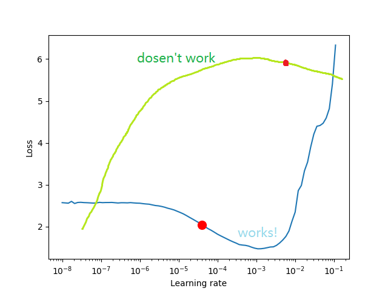
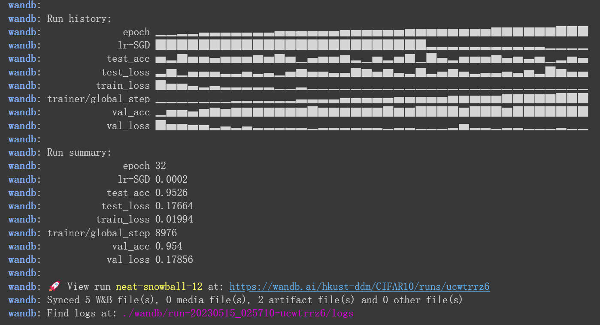

# Training and Tuning with Tricks for CIFAR-10 dataset in PyTorch and PyTorch Lightning

Jiang Wenxin

--------------------
- Easy convert


--------------------
- Less code, more efficient.
```python
callbacks = [
    ModelCheckpoint(monitor="val_acc", mode="max"),
    LearningRateMonitor(logging_interval="step"),
    StochasticWeightAveraging(swa_lrs=1e-2),
    early_stopping,
]
trainer = Trainer(
    max_epochs=50,
    devices='auto', # auto choose GPU or CPU
    logger=wandb_logger,
    callbacks=callbacks, # defined above
)
```
--------------------
##  Datasets and models

* Dataset: [CIFAR-10](https://www.cs.toronto.edu/~kriz/cifar.html)
* Model: ResNet18 or ResNet34 from [TorchVision.Models](https://pytorch.org/vision/0.8/models.html)
* Loss Function: NLL(Negative Log-Likelihood)
* Optimizer: SGD(Stochastic Gradient Descent) or Adam(Adaptive Moment Estimation)
* Hyperparameters: Learning Rate, Batch Size, Schedule, etc.

--------------------
### Transforms: Data Augmentation
Tools: random crop, random flip, random rotation, etc.
Benefits of data augmentation:
* Increase the size of the dataset -> Reduce **overfitting**
* Improve **generalization** -> Improve the performance of the model
* Increase at least **3%** accuracy in CIFA-10[^21]

[^21]:Shorten C, Khoshgoftaar T M. A survey on image data augmentation for deep learning[J]. Journal of big data, 2019, 6(1): 1-48.
--------------------
### Transforms: Data Normalization and Resizing
Tools: Normalize, Resize, etc.
Why data normalization?
* Easier to converge
* Prevent gradient explosion / vanish
* Make features have the same scale
  
Why data resizing?
* Reduce the size of the img -> Save time
* Fit the size of input layer
--------------------
### Transfer Learning
* Use the pretrained model to initialize the weights of the model
```python
model = torchvision.models.resnet18(pretrained=True)
```
Useful when dataset is small.

### Replicability and Determinism
```python
# for hardware
torch.backends.cudnn.deterministic = True
torch.backends.cudnn.benchmark = False
# for numpy/pytorch package
seed_everything(42)
```
--------------------
### Tricks: Learning Rate Finder
<small>(But it sometimes doesn't work well.)</small>
Not to pick the lowest loss, but in the middle of the sharpest downward slope (red point).

<!-- It determines a range of learning rates by gradually increasing the learning rate during training and observing the change in the loss function, thus helping us to better select the learning rate to improve the training effect and convergence speed of the model. -->


--------------------
## [Effective Training Techniques](https://lightning.ai/docs/pytorch/stable/advanced/training_tricks.html)
```python
callbacks = [
    LearningRateMonitor(logging_interval="step"),
    StochasticWeightAveraging(swa_lrs=1e-2),
    GradientAccumulationScheduler(scheduling={...}),
    early_stopping
]

trainer = Trainer(
    gradient_clip_val=0.5,
    devices='auto',  # default
    logger=wandb_logger,...
)
```
--------------------
- **Accumulate Gradients:**
Accumulated gradients run K small batches of size N before doing a backward pass, resulting a KxN effective batch size.

Control batch size, improve the stability and generalisation of the model
<!-- Increasing the batch size without increasing the memory overhead. Also, the gradient accumulation technique can help us reduce the variance of gradient descent and improve the stability and generalisation of the model. -->

--------------------
- **Early Stopping:**
Stop at the best epoch, not the last epoch.
Avoid over-fitting.

- **Gradient Clipping:** 
Gradient clipping can be enabled to **avoid exploding gradients**. 

- **Stochastic Weight Averaging:** 
Smooths the loss landscape thus making it harder to end up in a local minimum during optimization. Improves generalization.

- **Learning Rate Scheduler:**
Control learning rate. Make the model converge faster.

--------------------
- **Manage Experiment:** Weights and Biases: [WandB](https://wandb.ai/site)

Before training:

After training:


--------------------
- **Manage Experiment:** Weights and Biases: [WandB](https://wandb.ai/site)
Dashboard:

Or more commonly used: TensorBoard

--------------------
## Results


--------------------

# Thanks for your listening!
