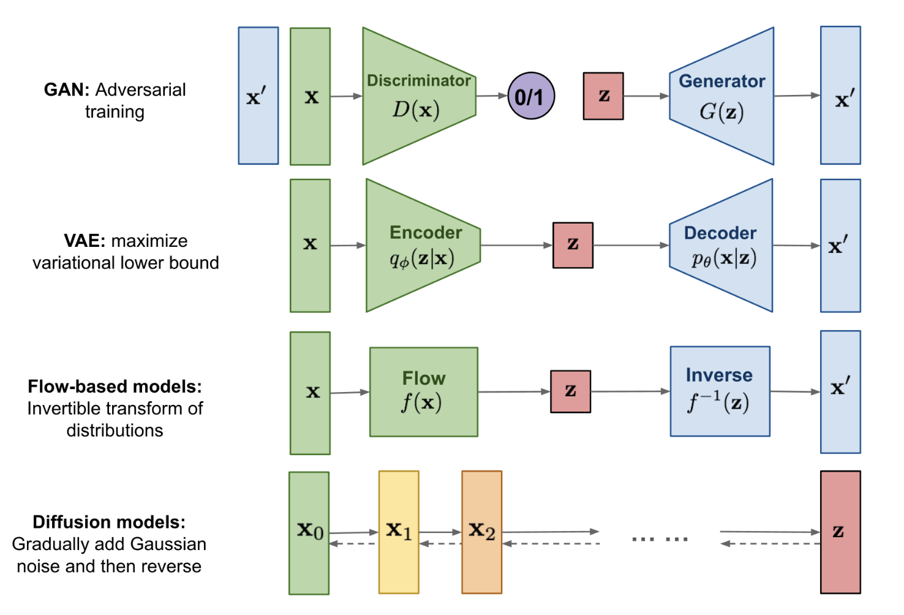
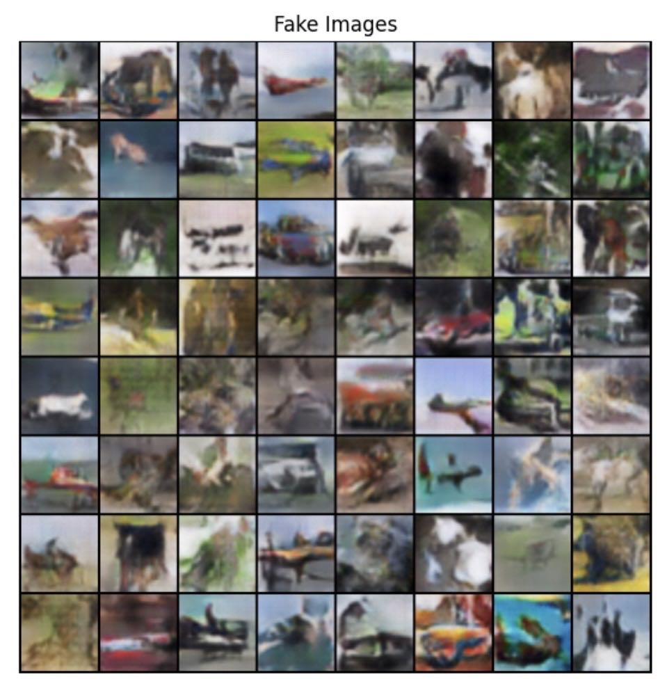
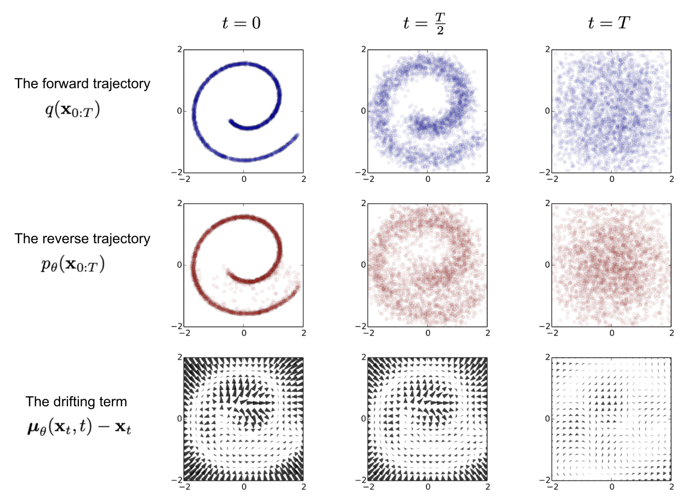
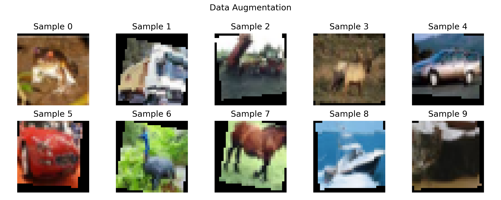
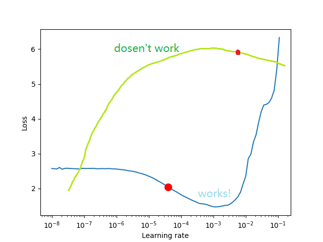

--------------------
##  Datasets and models

* Dataset: [CIFAR-10](https://www.cs.toronto.edu/~kriz/cifar.html)
* Model: ResNet18 or ResNet34 from [TorchVision.Models](https://pytorch.org/vision/0.8/models.html)
* Loss Function: NLL(Negative Log-Likelihood)
* Optimizer: SGD(Stochastic Gradient Descent) or Adam(Adaptive Moment Estimation)
* Hyperparameters: Learning Rate, Batch Size, Schedule, etc.

--------------------
### Data Augmentation: Image Generation

Data augmentation for image classification can help improve the performance of a machine learning model by increasing its ability to generalize to new and unseen data and can also help the model learn more robust and invariant features that are less sensitive to variations in lighting, orientation, and other factors.



--------------------
### Diffusion Moedel

Diffusion Models define a Markov chain of diffusion steps to slowly add random noise to data and then learn to reverse the diffusion process to construct desired data samples from the noise.
* Foward process 

$$
q(\mathcal{x}\_{t} \mid x_{t-1}) = \mathcal{N}(x_{t};\sqrt{1-\beta_t}x_{t-1},\beta_t I)
$$


*
*





--------------------
### Data Augmentation: Image Transformation
Tools: random crop, random flip, random rotation, etc.
Benefits of data augmentation:
* Increase the size of the dataset -> Reduce **overfitting**
* Improve **generalization** -> Improve the performance of the model
* Increase at least **3%** accuracy in CIFA-10[^21]

[^21]:Shorten C, Khoshgoftaar T M. A survey on image data augmentation for deep learning[J]. Journal of big data, 2019, 6(1): 1-48.
--------------------
### Data Augmentation: Data Normalization and Resizing
Tools: Normalize, Resize, etc.
Why data normalization?
* Easier to converge
* Prevent gradient explosion / vanish
* Make features have the same scale
  
Why data resizing?
* Reduce the size of the img -> Save time
* Fit the size of input layer
--------------------
### Transfer Learning
* Use the pretrained model to initialize the weights of the model
```python
model = torchvision.models.resnet18(pretrained=True)
```
Useful when dataset is small.

### Replicability and Determinism
```python
# for hardware
torch.backends.cudnn.deterministic = True
torch.backends.cudnn.benchmark = False
# for numpy/pytorch package
seed_everything(42)
```
--------------------
### Tricks: Learning Rate Finder
<small>(But it sometimes doesn't work well.)</small>
Not to pick the lowest loss, but in the middle of the sharpest downward slope (red point).

<!-- It determines a range of learning rates by gradually increasing the learning rate during training and observing the change in the loss function, thus helping us to better select the learning rate to improve the training effect and convergence speed of the model. -->

