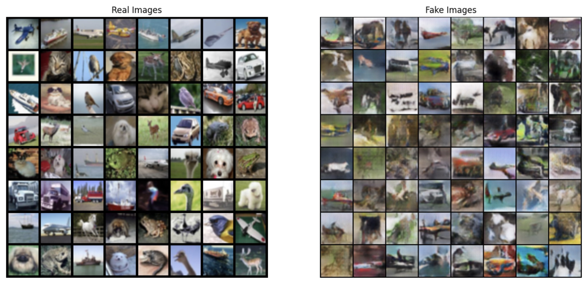

--------------------
### Data Augmentation: Image Generation

* Increasing model's ability to generalize to new and unseen data.
* Help the model learn more robust and invariant features.

--------------------
### ACGAN

--------------------
### Diffusion Model

* Foward process 

$$
q\left(x_t \mid x_{t-1}\right)=\mathcal{N}\left(x_t ; \sqrt{1-\beta_t} x_{t-1}, \beta_t \mathbf{I}\right)
$$

$$
q\left(x_{1: T} \mid 
x_0\right)=\prod_{t=1}^T q\left(x_t \mid x_{t-1}\right)
$$

* Reverse process 

$$
p_\theta\left(x_{0: T}\right)=p\left(x_T\right) \prod_{t=1}^T p_\theta\left(x_{t-1} \mid x_t\right)
$$

$$
p_\theta\left(x_{t-1} \mid 
x_t\right)=\mathcal{N}\left(x_{t-1} ; \mu_\theta\left(x_t, t\right), \Sigma_\theta\left(x_t, t\right)\right)
$$

* loss

$$
L_t^{\text {simple }} = \mathbb{E}_ {t \sim \[1,T\] , \mathbf{x}_ {0}, \boldsymbol{\epsilon}_ {t}} \left[||\boldsymbol{\epsilon}_ t-\boldsymbol{\epsilon}_ \theta\left(\sqrt{\bar{\alpha}_ t} \mathbf{x}_ 0+\sqrt{1-\bar{\alpha}_ t} \boldsymbol{\epsilon}_ t, t\right)||^2 \right]
$$

--------------------
### Generated Dataset

