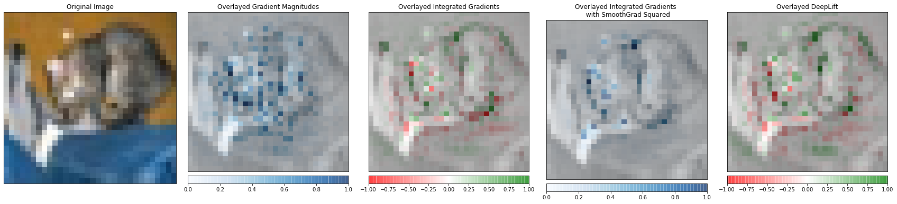
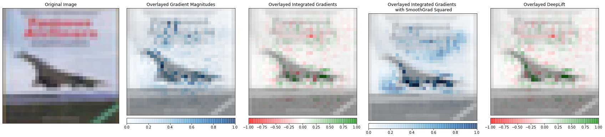
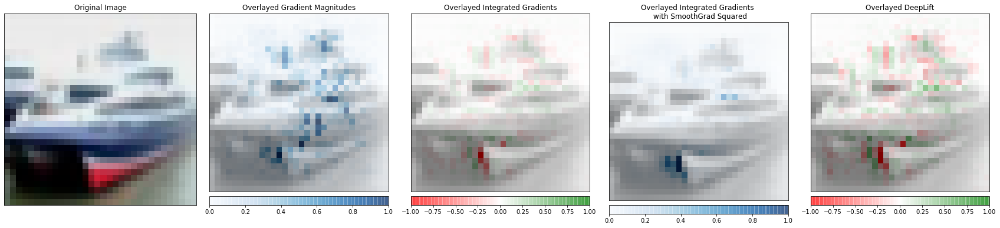
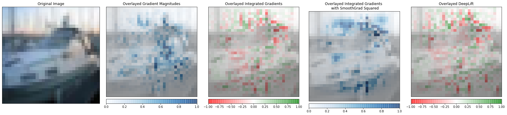
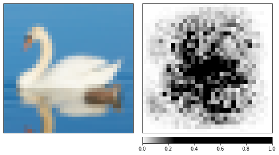
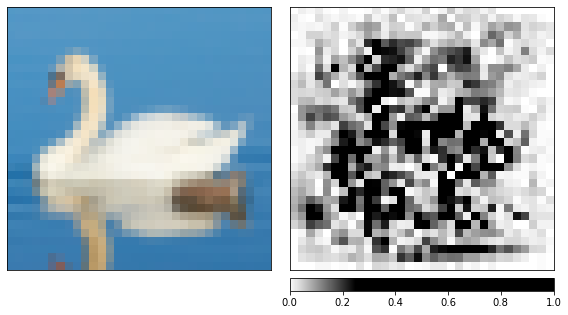
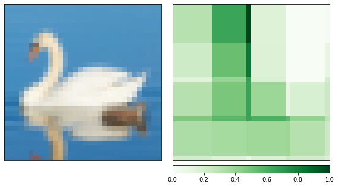
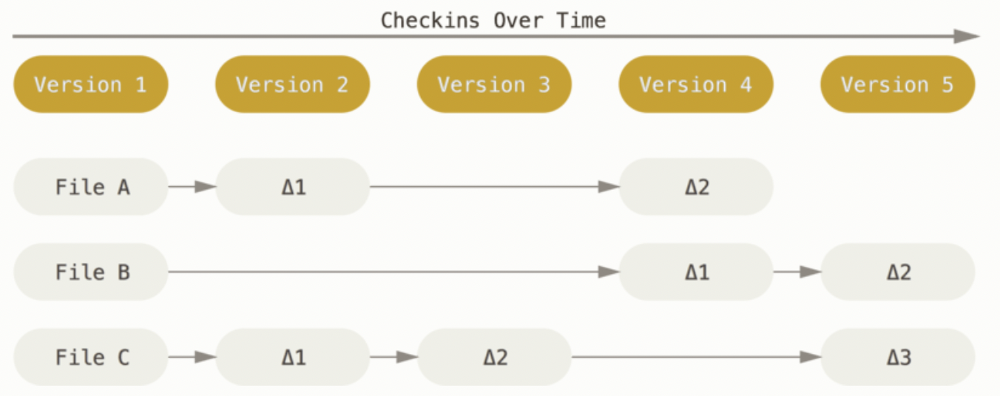

--------------------
##  Model interpretability on CIFAR-10

Apply model interpretability algorithms from Captum library on CIFAR-10 dataset in order to attribute the label of the image to the input pixels and visualize it.

* 1. Display the original image
* 2. Compute gradients with respect to its class and transposes them for visualization purposes.
* 3. Apply integrated gradients attribution algorithm to computes the integral of the gradients of the output prediction  for its class with respect to the input image pixels.
* 4. Use integrated gradients and noise tunnel with smoothgrad square option on the test image. Add gaussian noise to the input image $n times, computes the attributions for $n$ images and returns the mean of the squared attributions across $n images.
* 5. Apply DeepLift on test image. Deeplift assigns attributions to each input pixel by looking at the differences of output and its reference in terms of the differences of the input from the reference.

$$
\text { IntegratedGrads }_i(x)::=\left(x_i-x_i^{\prime}\right) \times \int_{\alpha=0}^1 \frac{\partial F\left(x^{\prime}+\alpha \times\left(x-x^{\prime}\right)\right)}{\partial x_i} d \alpha
$$

Results of "cat" class:

Results of "plane" class:

Results of "ship" class:

Results of "ship" class:

Then, we apply model interpretability algorithms with a handpicked image and visualizes the attributions for each pixel by overlaying them on the image.

* Integrated gradients smoothened by a noise tunnel.

* GradientShap, a linear explanation model which uses a distribution of reference samples to explain predictions of the model. 

* Occlusion-based attribution method to estimate which areas of the image are critical for the classifier's decision by occluding them and quantifying how the decision changes.

--------------------
## Collaboration with Git and Colab
Git is an open source distributed version control system for teams or individuals to handle projects quickly and efficiently. And colab is a free cloud service and supports free GPUs. It is a good choice for us to use git and colab to collaborate on the project, we managed the project and shared the code easily and efficiently in the teamwork.
